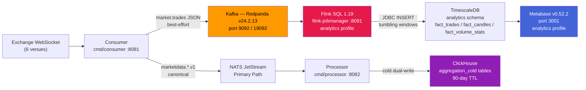

# Analytics Pipeline

**Status:** Active
**Last updated:** 2026-06-25
**Relates to:** `deploy/compose/docker-compose.yml`, `flink/sql/`, `sql/timescale/migrations/0009_analytics_metabase_views.sql`, `internal/adapters/kafka/`, `docs/architecture/diagrams/c4-analytics.md`

---

## Purpose

The analytics pipeline is a parallel, best-effort data path that taps canonical trade events
for business intelligence. It does **not** replace the NATS primary path — it augments it
with durable SQL-accessible data for Metabase dashboards and ad-hoc queries.

The analytics layer is deployed as an optional Docker Compose profile (`analytics`). The core
pipeline (NATS JetStream) continues to function whether or not the analytics profile is active.

---

## Architecture Overview



**Two independent pipelines:**

| Pipeline | Path | Delivery | Use case |
|----------|------|----------|----------|
| **Operational** | Consumer → NATS → Processor → Server/Store | Strict, at-least-once | Live cockpit, sub-millisecond latency |
| **Analytics** | Consumer → Kafka → Flink → TimescaleDB | Best-effort, seconds latency | BI dashboards, historical queries |

---

## Consumer → Kafka Bridge

The consumer enables dual-path publishing when `analytics.kafka.enabled: true` in
`deploy/configs/consumer.jsonc`.

Code anchor: `internal/adapters/kafka/composite_publisher.go:29`

**Semantics:** `CompositePublisher` calls the NATS publisher first (strict). If NATS succeeds,
it calls the Kafka `MarketPublisher` as best-effort — errors are logged and swallowed, never
propagated back. A NATS failure does NOT attempt Kafka.

**Routing by `MarketPublisher`** (`internal/adapters/kafka/market_publisher.go`):
- `marketdata.trade*` envelopes → decoded (proto or JSON) + re-serialized as flat JSON → `market.trades` topic
- `marketdata.bookdelta*` envelopes → **skipped** (orderbook deltas can exceed Kafka's default `max.message.bytes`)

### Kafka Wire Schema — `market.trades` topic

| Field | Type | Source |
|-------|------|--------|
| `venue` | string | `envelope.Venue` |
| `symbol` | string | `envelope.Instrument` |
| `trade_id` | string | decoded payload |
| `price` | float64 | decoded payload |
| `quantity` | float64 | decoded payload (`size` field alias) |
| `side` | string | decoded payload (`buy` / `sell`) |
| `ts_exchange_ms` | int64 | `envelope.TsExchange` |
| `ts_ingest_ms` | int64 | `envelope.TsIngest` |

Code anchor: `internal/adapters/kafka/market_publisher.go:15` (tradeKafkaMessage struct)

**This schema is a wire contract.** Changes to the struct require updating the Flink source
table in `flink/sql/00_create_sources.sql` in the same commit.

---

## Kafka (Redpanda v24.2.13)

Infrastructure: `deploy/compose/docker-compose.yml`

**No profile gate** — Kafka starts with every `make up` / `make up-infra` / `make up-core`.

| Parameter | Value |
|-----------|-------|
| Image | `redpandadata/redpanda:v24.2.13` |
| Internal broker | `kafka:9092` |
| Host broker | `localhost:19092` |

**Topics:**

| Topic | Producer | Consumer | Schema |
|-------|----------|---------|--------|
| `market.trades` | Consumer (`MarketPublisher`) | Flink (`flink-market-trades` group) | Flat JSON (see wire schema above) |
| `market.orderbook` | Consumer (`MarketPublisher`) | *(no active consumer)* | Raw bytes (future use) |

---

## Flink SQL Pipeline (Apache Flink 1.19)

Infrastructure: `deploy/compose/docker-compose.yml` — `analytics` profile.

Three compose services:
- `flink-jobmanager` — REST API and scheduler (host port 8091)
- `flink-taskmanager` — task execution worker
- `flink-sql-init` — one-shot job submitter (`restart: "no"`)

`flink-sql-init` concatenates all `flink/sql/0*.sql` files in lexicographic order and submits
them as a single Flink SQL session.

### Source Tables (`flink/sql/00_create_sources.sql`)

| Table | Kafka topic | Group ID | Watermark |
|-------|-------------|---------|-----------|
| `kafka_trades` | `market.trades` | `flink-market-trades` | 5 seconds event-time |
| `kafka_orderbook` | `market.orderbook` | `flink-market-orderbook` | 5 seconds event-time (no active jobs) |

### Sink Tables (`flink/sql/01_create_sinks.sql`)

All sinks write to TimescaleDB `analytics` schema via JDBC connector.

| Flink sink table | TimescaleDB table | Upsert key | Flush |
|-----------------|-------------------|-----------|-------|
| `pg_fact_trades` | `analytics.fact_trades` | `(exchange_name, symbol, trade_id)` | 500 rows / 2s |
| `pg_fact_candles` | `analytics.fact_candles` | `(exchange_name, symbol, timeframe, open_time_ms)` | 200 rows / 5s |
| `pg_fact_volume_stats` | `analytics.fact_volume_stats` | `(exchange_name, symbol, window_secs, window_start_ms)` | 200 rows / 5s |

### SQL Jobs

| File | Description |
|------|-------------|
| `flink/sql/02_ohlcv_job.sql` | 4× `INSERT INTO pg_fact_candles`: tumbling windows 1m, 5m, 15m, 1h using `FIRST_VALUE`/`LAST_VALUE` for open/close |
| `flink/sql/03_volume_stats_job.sql` | 5-minute volume stats: total/buy/sell volume, `trade_count`, VWAP per symbol |
| `flink/sql/04_trade_tape_job.sql` | Append-only trade tape: every raw trade copied to `fact_trades` |

**Watermark latency floor:** The 5-second event-time watermark means tumbling window results
are emitted at most 5 seconds after the window boundary.

---

## TimescaleDB Analytics Schema

Created by migration: `sql/timescale/migrations/0009_analytics_metabase_views.sql`

### Fact Tables (owned by Flink)

| Table | Purpose | Owner |
|-------|---------|-------|
| `analytics.fact_trades` | Raw trade tape (append-only) | Flink (`04_trade_tape_job.sql`) |
| `analytics.fact_candles` | OHLCV by timeframe (1m/5m/15m/1h) | Flink (`02_ohlcv_job.sql`) |
| `analytics.fact_volume_stats` | Volume aggregations (5-min windows) | Flink (`03_volume_stats_job.sql`) |

### Views (queryable by Metabase)

| View | Description |
|------|-------------|
| `v_market_summary_24h` | 24h summary: volume, trade count, buy/sell split, VWAP, high/low per symbol |
| `v_candles` | OHLCV with derived `price_change` and `price_change_pct` |
| `v_volume_stats` | Volume with buy/sell ratio, `delta_volume`, `delta_pct` |
| `v_cvd` | Cumulative Volume Delta via window sum over `fact_volume_stats` |
| `v_ingestion_latency` | Per-trade latency (`ts_ingest_ms − ts_exchange_ms`) for monitoring |
| `v_agg_candles` | Alias of `aggregation_candle` (hot-path OHLCV with buy/sell) |
| `v_agg_stats` | Alias of `aggregation_stats` (liquidations, mark price, funding rate) |
| `v_agg_oi` | Alias of `aggregation_oi` (open interest with delta) |
| `v_agg_cvd` | Alias of `aggregation_cvd` (CVD from hot-path) |
| `v_agg_tape` | Alias of `aggregation_tape` (trade-flow tape with burst flag) |
| `v_agg_delta_volume` | Alias of `aggregation_delta_volume` (per-window delta with flow ratio) |

---

## Metabase (v0.52.2)

Infrastructure: `deploy/compose/docker-compose.yml` — `analytics` profile. Port 3001.

```bash
# Start analytics profile
make up-analytics

# Provision dashboards (run once after Metabase reports healthy)
make metabase-provision

# Smoke check
curl -sf http://127.0.0.1:3001/api/health && echo "metabase: OK"
```

---

## Separation from ClickHouse Cold Path

The Flink analytics pipeline (→ TimescaleDB `analytics` schema) is **entirely separate**
from the ClickHouse cold path managed by `cmd/store`.

| Aspect | Flink analytics | ClickHouse cold |
|--------|----------------|----------------|
| Source | Kafka `market.trades` | NATS JetStream `aggregation.*` |
| Target | TimescaleDB `analytics` schema | ClickHouse `default` database |
| Profile gate | `analytics` | none (always runs via `cmd/store`) |

Flink does NOT write to ClickHouse. ClickHouse is not a Flink sink.

---

## Operational Notes

**Flink job resubmission** — `flink-sql-init` has `restart: "no"` (runs once). To re-submit:
```bash
docker compose -f deploy/compose/docker-compose.yml \
  --env-file deploy/envs/local.env \
  --profile analytics \
  restart flink-sql-init
```

**Kafka lag monitoring:**
```bash
rpk group describe flink-market-trades --brokers=localhost:19092
```

**Flink overview:**
```bash
curl -s http://127.0.0.1:8091/overview | jq .taskmanagers
```
