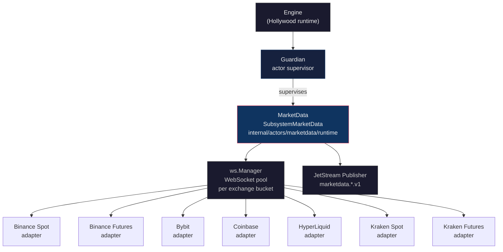
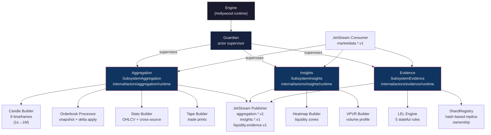
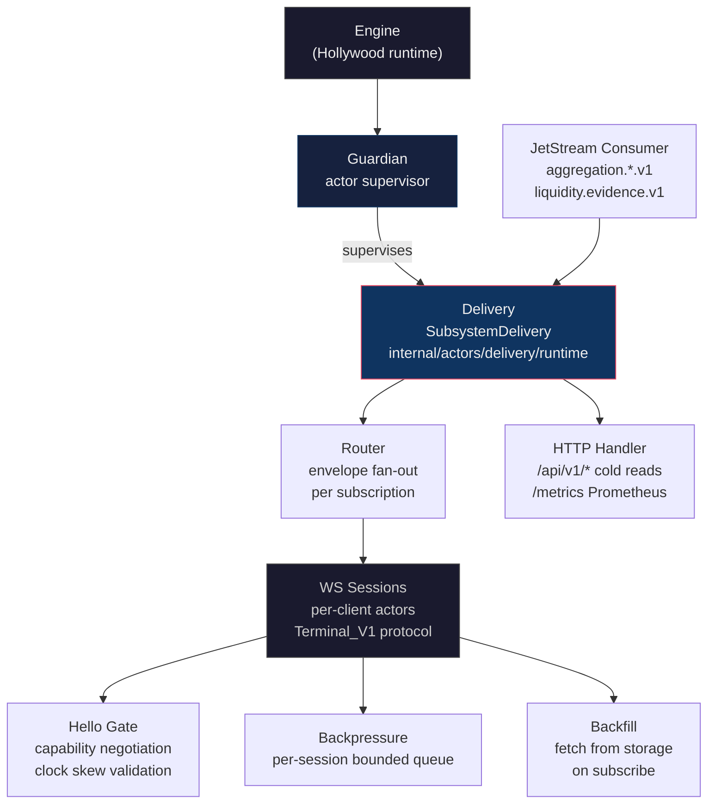
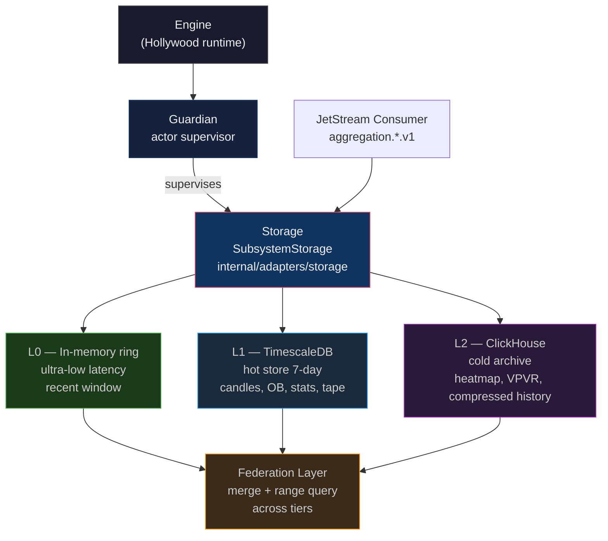

# Actor Supervision Tree

**Status:** Active
**Last updated:** 2026-06-25
**Relates to:** `docs/architecture/subsystems.md`, `docs/architecture/diagrams/c4-containers.md`
**Code anchor:** `internal/actors/runtime/guardian.go`

---

## What this shows

The Hollywood actor supervision tree for each binary. The Guardian orchestrates subsystem actors
with exponential backoff and circuit-breaking. Actors coordinate; use cases decide; domain enforces.

---

## Supervision Policy (all binaries)

```
BaseBackoff:     250ms
MaxBackoff:      5s
RestartWindow:   30s
RestartLimit:    5 per window
GlobalLimit:     5 restarts/min  (circuit breaker)
```

Code: `internal/actors/runtime/guardian.go:273`

---

## cmd/consumer — MarketData Pipeline



> **Note:** Dynamic per-exchange actors use key `marketdata:{exchange}` and bypass the static
> `SubsystemMarketData` slot when present (`guardian.go:603-616`).

---

## cmd/processor — Aggregation + Insights + Evidence



---

## cmd/server — Delivery Gateway



---

## cmd/store — Storage Lifecycle


