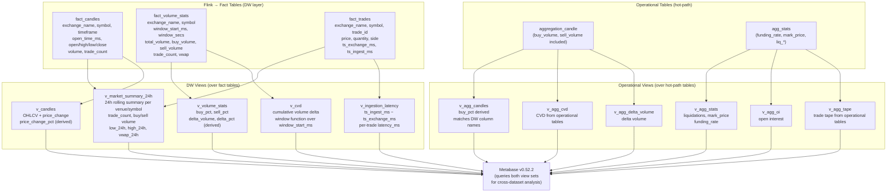

# TimescaleDB Analytics Schema

**Status:** Active
**Last updated:** 2026-06-26
**Relates to:** `docs/architecture/analytics-pipeline.md`, `sql/timescale/migrations/0009_analytics_metabase_views.sql`
**Code anchors:** `sql/timescale/migrations/0009_analytics_metabase_views.sql`

---

## What this shows

The TimescaleDB `analytics` schema has two source layers: Flink-populated fact tables (DW layer)
and hot-path operational tables (aliased into the analytics schema). Eleven views sit above both
layers and are the direct query targets for Metabase dashboards.

---

## Schema Overview

---

## Source Layer Comparison

| Layer | Source tables | Populated by | Latency | Use case |
|-------|--------------|--------------|---------|----------|
| **DW** | `fact_candles`, `fact_volume_stats`, `fact_trades` | Flink SQL (JDBC) | 10–90 s | BI dashboards, historical queries |
| **Operational** | `aggregation_candle`, `agg_stats`, … | Store binary (NATS path) | < 1 s | Cross-dataset joins in Metabase |

Metabase queries both layers via the unified `analytics` schema — the `v_agg_*` views alias
hot-path columns to match DW naming conventions (`venue` → `exchange_name`, `instrument` → `symbol`).

---

## Related Diagrams

- [Flink Jobs Detail](flink-jobs-detail.md) — how fact tables are populated
- [C4 Analytics](c4-analytics.md) — container topology of the full analytics profile
- [Analytics Pipeline Sequence](sequence-analytics-pipeline.md) — end-to-end event flow
