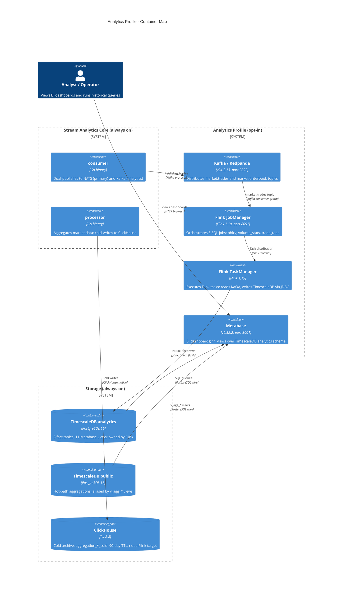

# C4 Level 2 — Analytics Profile Container Map

**Status:** Active
**Last updated:** 2026-06-25
**Relates to:** `docs/architecture/analytics-pipeline.md`, `docs/architecture/diagrams/c4-containers.md`

---

## What this shows

The analytics Docker Compose profile containers and their relationships.
Complements the main C4 Container Map by focusing on the
best-effort analytics branch (Kafka → Flink → TimescaleDB analytics → Metabase).

---

## Diagram

---

## Key Architectural Decisions

| Decision | Rationale |
|----------|-----------|
| Kafka has no profile gate | Starts with core stack — costs nothing idle; avoids dependency gap when analytics is enabled |
| Flink writes only to TimescaleDB `analytics` schema | Keeps analytics and operational schemas isolated; ClickHouse is not a Flink target |
| Metabase reads both schemas | The 11 views include `v_agg_*` aliases of hot-path tables for cross-dataset analysis |
| `flink-sql-init` is one-shot | Jobs submitted once; Flink manages them. Re-submit manually after schema changes |
