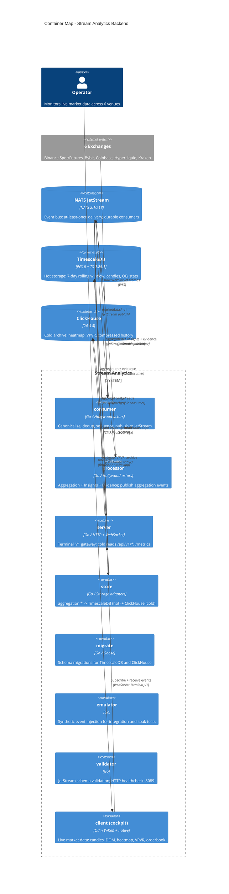

# C4 Level 2 — Container Map

**Status:** Active
**Last updated:** 2026-06-25
**Relates to:** `docs/architecture/diagrams/c4-context.md`, `docs/architecture/subsystems.md`

---

## What this shows

The 7 service binaries, the shared message bus, and storage tiers — with their primary
communication paths and protocols. Internal module structure is not shown here.

---

## Diagram

---

## Subject Taxonomy (JetStream Streams)

| Stream prefix | Producer | Primary consumers |
|---------------|----------|-------------------|
| `marketdata.*.v1` | consumer | processor |
| `aggregation.*.v1` | processor | store, server |
| `insights.*.v1` | processor | server |
| `liquidity.evidence.v1` | processor (Evidence) | server |

Full subject registry: `docs/contracts/event-bus.md`

---

## Runtime Supervision

Each binary runs a **Guardian** actor that manages its subsystem actors with:
- Base backoff: 250ms, max backoff: 5s
- Restart window: 30s, restart limit: 5 per window
- Global circuit breaker: 5 restarts/min

For the actor tree per binary, see Actor Supervision Tree (`actor-supervision-tree.md`).

---

## Storage Tier Summary

| Tier | Technology | Retention | Use case |
|------|------------|-----------|----------|
| L0 | In-memory ring buffer | ~minutes | Ultra-low latency recent reads |
| L1 | TimescaleDB | 7 days rolling | Hot OHLCV, orderbook, stats |
| L2 | ClickHouse | Long-term archive | Heatmap, VPVR, analytical queries |

Federation logic: [`internal/adapters/storage/federation/merge.go`](https://github.com/FabioCaffarello/stream-analytics/blob/main/internal/adapters/storage/federation/merge.go)
