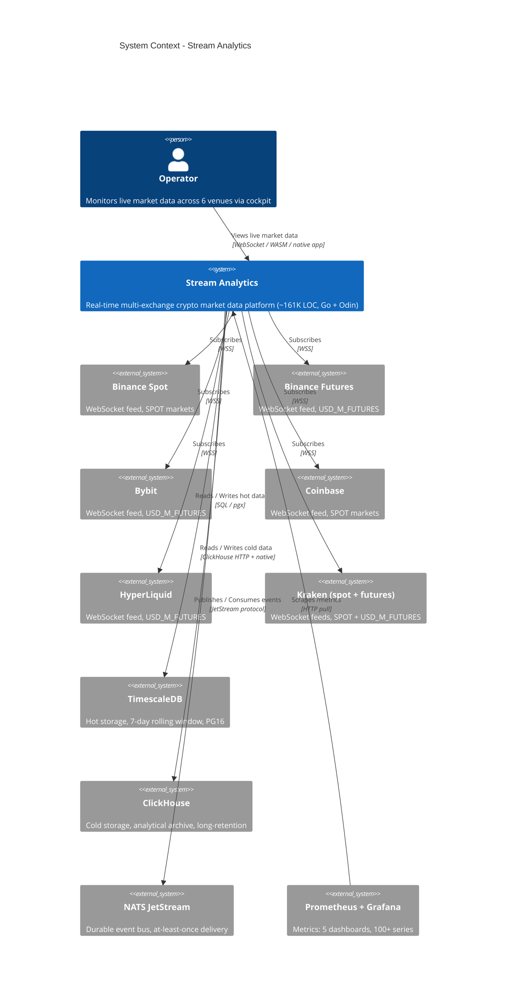

# C4 Level 1 — System Context

**Status:** Active
**Last updated:** 2026-06-25
**Relates to:** `docs/architecture/README.md`, `docs/architecture/diagrams/c4-containers.md`

---

## What this shows

Stream Analytics in its external environment: who interacts with it, what external systems it depends on,
and what it produces. No internal detail — only the system boundary and its relationships.

---

## Diagram

---

## Key Decisions Visible at This Level

| Decision | Rationale |
|----------|-----------|
| NATS JetStream as central bus | At-least-once delivery, durable consumers, replay-safe; decouples ingestion from aggregation |
| Dual storage (TimescaleDB + ClickHouse) | TimescaleDB optimizes recent time-series queries; ClickHouse handles analytical/archive reads efficiently |
| Multi-exchange fan-in | 6 venues normalized to a single Canonical Market Model (CMM) — consumers see one event shape |
| Operator-facing only | This is decision infrastructure, not a public API. No external data consumers beyond the cockpit |

---

## What Is NOT Shown Here

- Internal services and actors — see [C4 Container Map](c4-containers.md)
- Data flow sequencing — see [Live Data Ingestion](sequence-live-ingestion.md)
- Actor supervision tree — see [Actor Supervision Tree](actor-supervision-tree.md)
