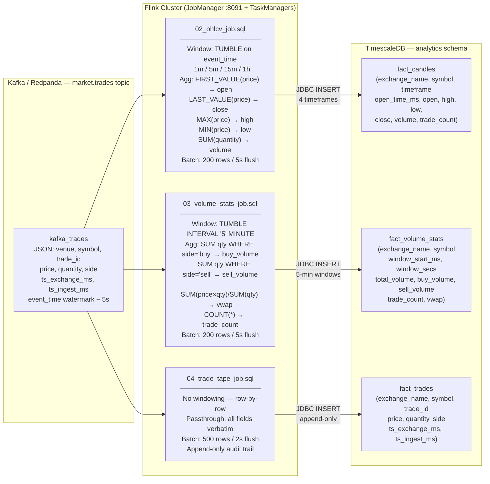

# Flink SQL Jobs — Detail

**Status:** Active
**Last updated:** 2026-06-26
**Relates to:** `docs/architecture/analytics-pipeline.md`, `flink/sql/`, `docs/architecture/diagrams/c4-analytics.md`
**Code anchors:** `flink/sql/02_ohlcv_job.sql`, `flink/sql/03_volume_stats_job.sql`, `flink/sql/04_trade_tape_job.sql`

---

## What this shows

The three Flink SQL jobs that run concurrently inside the Flink cluster, their Kafka source,
window types, key aggregation logic, and TimescaleDB sinks. All three jobs share the same
`kafka_trades` source connector but produce independent output tables.

---

## Diagram

---

## Key Architectural Notes

| Property | Value |
|----------|-------|
| Flink version | Apache Flink SQL 1.19 |
| Source connector | Kafka (Redpanda) — `market.trades` topic |
| Sink connector | JDBC → TimescaleDB `analytics` schema |
| Watermark slack | 5 seconds (event-time lag tolerance) |
| Job submission | One-shot via `flink-sql-init` container at startup |
| Recovery | Flink manages job restart; re-submit manually after schema changes |
| Startup mode | `scan.startup.mode: latest-offset` — events before Flink connects are not replayed |

The three jobs run **concurrently** inside the Flink TaskManagers. A failure in one job does not
affect the others. All three read from the same Kafka topic via independent consumer groups.
