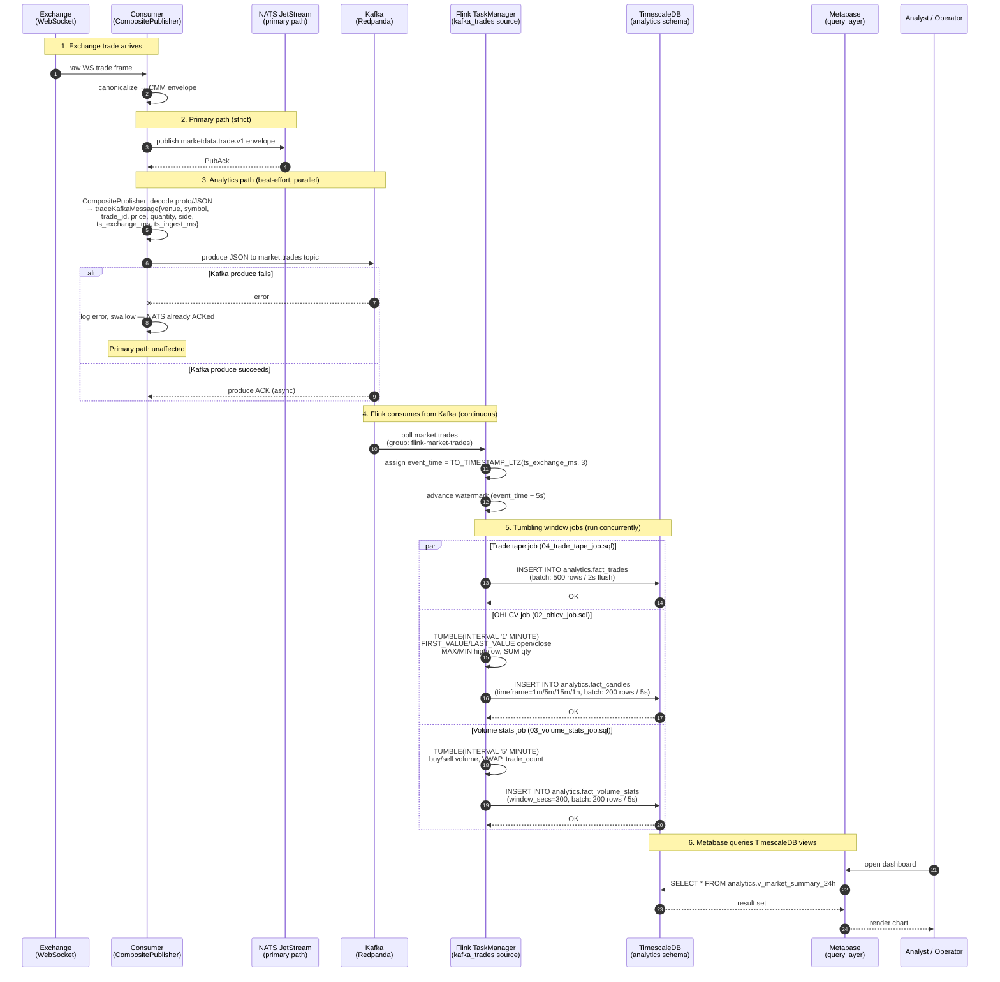

# Sequence Diagram — Analytics Pipeline

**Status:** Active
**Last updated:** 2026-06-25
**Relates to:** `docs/architecture/analytics-pipeline.md`, `docs/architecture/diagrams/c4-analytics.md`
**Code anchors:** `internal/adapters/kafka/composite_publisher.go`, `flink/sql/`, `sql/timescale/migrations/0009_analytics_metabase_views.sql`

---

## What this shows

The end-to-end flow of the analytics pipeline: from the consumer publishing to Kafka
(best-effort alongside the primary NATS path), through Flink SQL tumbling window
aggregations, to TimescaleDB and Metabase.

---

## Analytics Pipeline Sequence

---

## Latency Budget

| Stage | Latency | Notes |
|-------|---------|-------|
| Exchange → Consumer | ~1–10ms | Network + WebSocket parsing |
| Consumer → Kafka | ~1–5ms | Batch timeout 250ms max |
| Kafka → Flink poll | ~100–500ms | Poll interval |
| Flink watermark advance | 5 seconds | Fixed event-time slack |
| Flink window emission | 0–60s after window close | 1m window = up to 65s total |
| JDBC flush to TimescaleDB | 2–5s | 200–500 rows or timeout |
| Metabase query | ~10–500ms | View complexity |
| **Total end-to-end** | **~10–90 seconds** | For 1-minute candle to appear |

This is by design — the analytics path trades latency for queryability.

---

## Key Invariant: Best-Effort Semantics

Step 3 shows that Kafka publish failures are silently absorbed:
- Analytics pipeline can tolerate Kafka downtime without affecting the primary NATS path
- Some trades may be missing from Flink aggregations if Kafka was down during ingestion
- No exactly-once guarantee between Consumer and Kafka (at-most-once in practice)
- Flink uses `scan.startup.mode: latest-offset` — events before Flink connects are not replayed

---

## Related Diagrams

- C4 Analytics (`c4-analytics.md`) — container topology for this pipeline
- Live Data Ingestion (`sequence-live-ingestion.md`) — the primary NATS path (step 2 above)
- Storage Federation (`sequence-storage-federation.md`) — ClickHouse cold path (separate)
