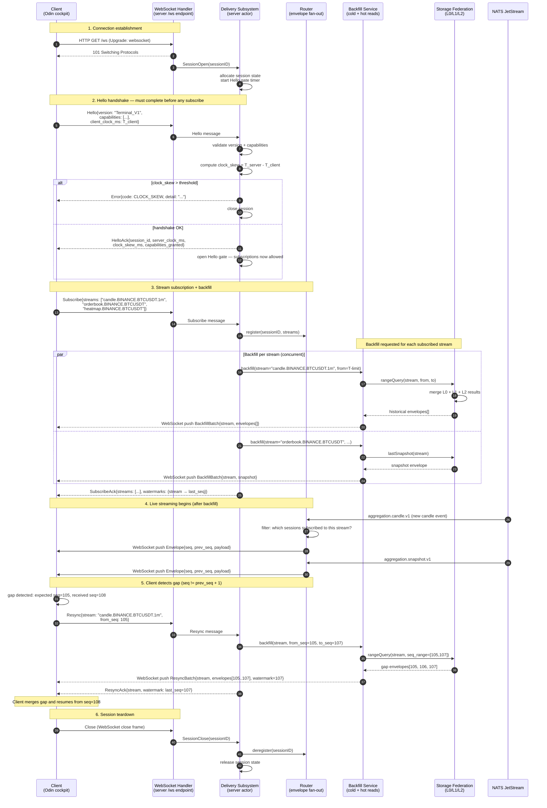

# Sequence Diagram — Client Session Protocol (Terminal_V1)

**Status:** Active
**Last updated:** 2026-06-25
**Relates to:** `docs/contracts/delivery-ws.md`, `docs/architecture/diagrams/sequence-live-ingestion.md`
**Code anchor:** `internal/actors/delivery/runtime/session_protocol.go`, `internal/actors/delivery/runtime/session_commands.go`

---

## What this shows

The full lifecycle of a client WebSocket session using the Terminal_V1 protocol:
connection, Hello handshake, subscription, backfill from storage, live streaming,
and the Resync flow that restores coherence after a gap.

---

## Session Lifecycle

---

## Hello Gate Invariant

The Hello gate is a mandatory pre-condition: **no Subscribe or data message is processed until
HelloAck is sent**. Any message arriving before Hello completes is rejected with `PROTOCOL_VIOLATION`.

Code: `internal/actors/delivery/runtime/session_protocol.go:requireHelloGate`
Test: `internal/actors/delivery/runtime/session_protocol_contract_test.go`

---

## Prev_Seq Chain Invariant

Every envelope delivered over WebSocket carries:
- `seq` — monotonically increasing per stream
- `prev_seq` — the seq of the immediately preceding envelope

The client uses `prev_seq` to detect gaps without needing a heartbeat. A gap triggers Resync.

Test: `TestProtocol_PrevSeqChain_MonotonicAcrossEvents`

---

## Backpressure on Slow Clients

If the session's per-client bounded queue fills (slow network / frozen client):
1. Router drops the envelope and increments `session_drop_total`.
2. After N consecutive drops, Delivery marks the session as `lagging`.
3. A lagging session receives a `Resync` signal automatically on reconnect.

See [`docs/architecture/subsystems.md`](../subsystems.md) — Delivery section for bounds.

---

## Related Diagrams

- [Live Data Ingestion](sequence-live-ingestion.md) — how events arrive at Router (step 12 above)
- [Storage Federation Write Path](sequence-storage-federation.md) — how StorFed serves backfill queries
