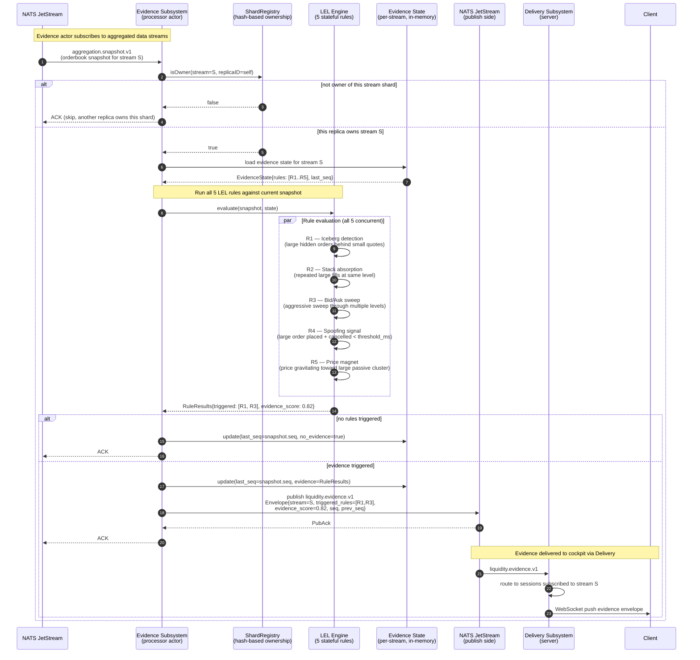
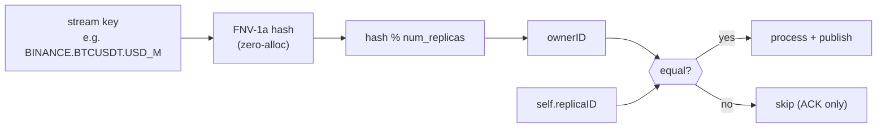

# Sequence Diagram — Evidence Detection (Liquidity Evidence Layer)

**Status:** Active
**Last updated:** 2026-06-25
**Relates to:** `docs/contracts/liquidity-evidence-layer.md`, `docs/architecture/insights.md`
**Code anchor:** `internal/core/evidence/`, `internal/actors/evidence/runtime/`

---

## What this shows

How the Liquidity Evidence Layer (LEL) detects stateful liquidity signals from aggregated
market data. Includes multi-replica ownership via hash-based shard assignment to prevent
duplicate evidence publishing across processor instances.

---

## Evidence Detection Sequence

---

## Multi-Replica Ownership (ShardRegistry)

The Evidence subsystem can run across multiple `cmd/processor` replicas. To prevent
duplicate evidence publishing for the same stream, each replica consults the `ShardRegistry`:

Code: `internal/shared/hash/` (FNV-1a), `internal/shared/shardregistry/`

---

## LEL Rules Reference

| Rule | Signal | State required |
|------|--------|----------------|
| R1 — Iceberg | Large hidden order behind thin quote | Last N snapshots at level |
| R2 — Stack absorption | Repeated large aggressor fills at same price | Cumulative fill tracker |
| R3 — Bid/Ask sweep | Aggressive sweep through ≥3 consecutive levels | Level-by-level fill history |
| R4 — Spoofing | Order placed and cancelled within threshold_ms | Pending order timestamps |
| R5 — Price magnet | Price movement toward a dominant passive cluster | Rolling price + OB cluster |

Authoritative contract: [`docs/contracts/liquidity-evidence-layer.md`](../../contracts/liquidity-evidence-layer.md)

---

## Evidence Score

`evidence_score` is a composite `[0.0, 1.0]` value derived from:
- Number of rules triggered
- Confidence weight per rule
- Recency of corroborating signals

The cockpit displays evidence overlays when `evidence_score > threshold` (configurable per operator workspace).

---

## Related Diagrams

- [Live Data Ingestion](sequence-live-ingestion.md) — how aggregation.snapshot.v1 reaches the Evidence actor
- [Client Session Protocol](sequence-client-session.md) — how the client receives liquidity.evidence.v1 envelopes
