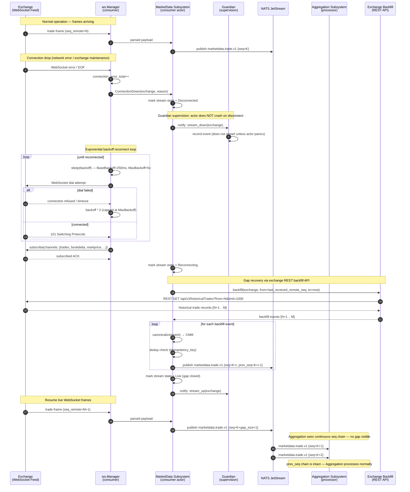
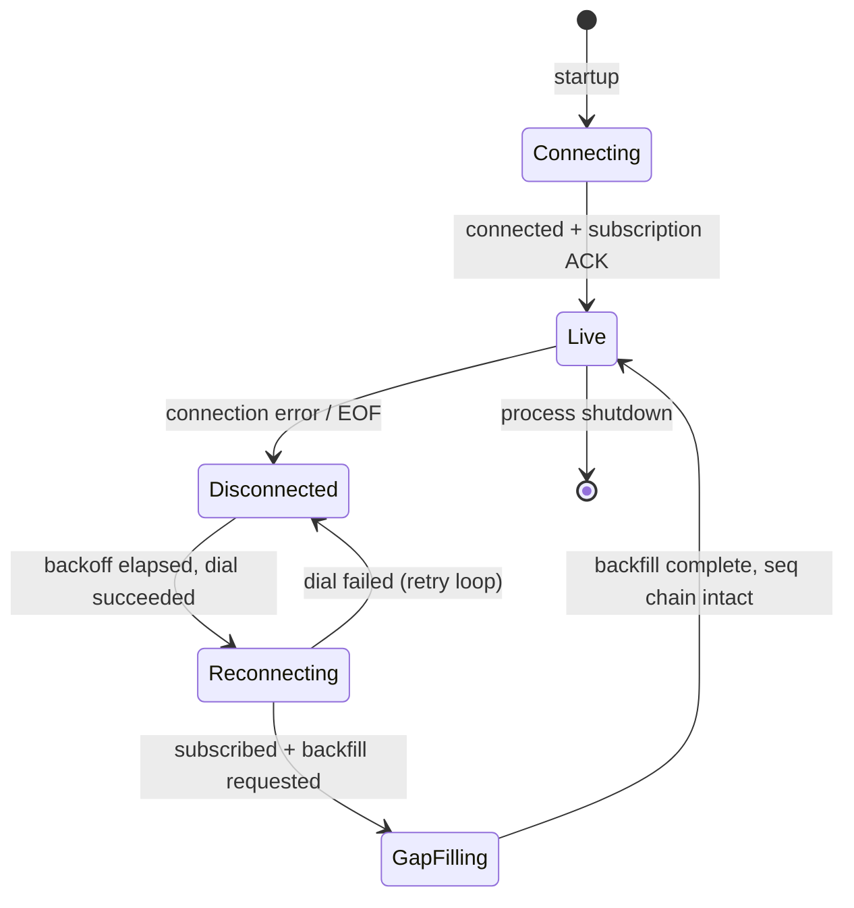

# Sequence Diagram — Exchange Reconnect & Recovery

**Status:** Active
**Last updated:** 2026-06-25
**Relates to:** `docs/architecture/subsystems.md`, `docs/architecture/sequencing-model.md`
**Code anchor:** `internal/actors/marketdata/ws/manager.go`, `internal/actors/runtime/guardian.go`

---

## What this shows

What happens when an exchange WebSocket connection drops: the reconnect cycle with
exponential backoff, the gap detection on resume, and how the sequencing model
ensures downstream consistency despite the interruption.

---

## Disconnect, Reconnect & Gap Recovery

---

## Stream State Machine (MarketData)

---

## Client-Side Impact

From the client cockpit perspective, a brief exchange disconnect is transparent if:
- Backfill covers the gap completely
- The `prev_seq` chain remains unbroken in the envelopes the client receives

If the gap is larger than the backfill window (e.g., exchange was down for hours),
the Aggregation subsystem publishes a `stream_gap` signal and the Delivery subsystem
triggers a Resync for affected client sessions.

---

## Key Counters (Prometheus)

| Metric | What it tracks |
|--------|----------------|
| `ws_connection_errors_total{exchange}` | Total WebSocket errors per exchange |
| `ws_reconnect_attempts_total{exchange}` | Reconnect attempts (backoff cycles) |
| `ws_backfill_events_total{exchange}` | Events recovered via REST backfill |
| `ws_gap_total{exchange}` | Unrecoverable gaps (backfill window exhausted) |

---

## Related Diagrams

- [Live Data Ingestion](sequence-live-ingestion.md) — the normal path this sequence restores
- [Actor Supervision Tree](actor-supervision-tree.md) — how Guardian fits into the recovery model
