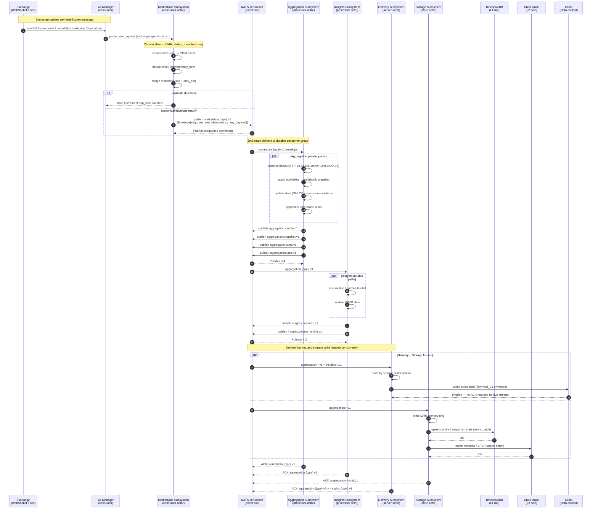

# Sequence Diagram — Live Data Ingestion

**Status:** Active
**Last updated:** 2026-06-25
**Relates to:** `docs/architecture/subsystems.md`, `docs/contracts/event-bus.md`

---

## What this shows

The end-to-end happy path for live market data: from an exchange WebSocket message
arriving at the Consumer, through NATS JetStream, through the Processor's aggregation
pipeline, and finally to both storage and connected client sessions.

---

## Full Pipeline Sequence

---

## Key Invariants Illustrated

| # | Invariant | Where enforced |
|---|-----------|----------------|
| 1 | Every envelope carries `seq` + `prev_seq` — receivers detect gaps | `internal/shared/envelope` |
| 2 | `idempotency_key` prevents duplicate processing across restarts | `MDSub` dedup check (step 5) |
| 3 | ACK is sent only after successful processing — NAK triggers redelivery | `internal/adapters/jetstream/ingest_policy.go:59` |
| 4 | Delivery and Storage are independent JetStream consumers — one slow writer cannot block the other | Container isolation in docker-compose |
| 5 | L0 write is synchronous; L1/L2 writes are async batched — latency budget preserved | `internal/adapters/storage/federation/merge.go` |

---

## Backpressure Paths

- **Consumer:** `ws.Manager` drops messages when `MaxEntries=20_000` canonical state cap is reached (`ws_backpressure_drops_total` counter).
- **Delivery:** Per-session bounded queue; slow clients receive NACK and the session triggers resync.
- **Insights (VPVR):** `vpvr_overload_policy.go` sheds load when budget is exceeded without blocking the aggregation path.

---

## Related Diagrams

- [Client Session Protocol](sequence-client-session.md) — how the client receives the events pushed in step 16
- [Storage Federation Write Path](sequence-storage-federation.md) — steps 18–21 in detail
- [Exchange Reconnect & Recovery](sequence-exchange-recovery.md) — what happens when step 1 fails
