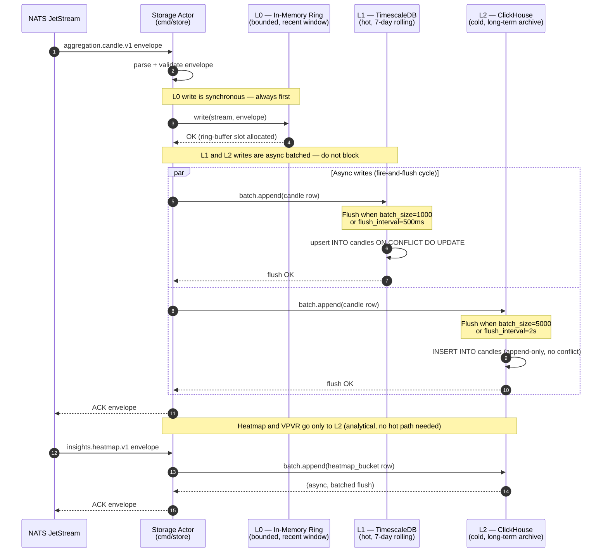
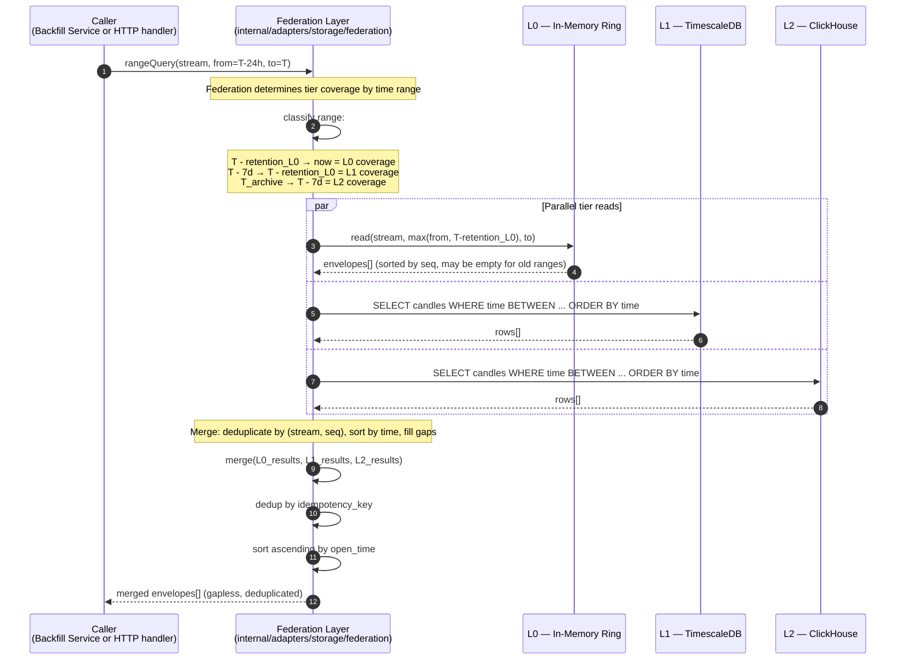

# Sequence Diagram — Storage Federation Write & Read Path

**Status:** Active
**Last updated:** 2026-06-25
**Relates to:** `docs/architecture/storage.md`, `docs/architecture/diagrams/c4-containers.md`
**Code anchor:** `internal/adapters/storage/federation/merge.go`, `internal/adapters/storage/federation/candle_reader.go`

---

## What this shows

How the Storage subsystem receives aggregated envelopes from JetStream and fans them out
across three tiers (L0 → L1 → L2), and how federated reads merge results across tiers
when the server serves a historical range query or backfill.

---

## Write Path — Tier Fan-out

---

## Read Path — Federated Range Query

---

## Retention & Coverage Rules

| Tier | Technology | Typical retention | Written by | Read by |
|------|------------|-------------------|------------|---------|
| L0 | In-memory ring buffer | ~5 min (bounded slots) | Storage actor (sync) | Federation, Backfill |
| L1 | TimescaleDB | 7 days rolling | Storage actor (async batch) | Federation, HTTP /api/v1/* |
| L2 | ClickHouse | Indefinite (archive) | Storage actor (async batch) | Federation, HTTP /api/v1/* |

Heatmap and VPVR data skip L0 and L1 — they land only in L2 due to their analytical nature and large row size.

---

## Idempotency on Write

TimescaleDB upserts use `ON CONFLICT (stream_id, open_time, timeframe) DO UPDATE` to
handle redelivered envelopes after a consumer restart. ClickHouse uses append-only inserts;
deduplication on read is handled by the federation merge layer.

Code: `internal/adapters/storage/timescale/candle_reader.go:1`
Test: `internal/adapters/storage/federation/consistency_test.go:1`

---

## Related Diagrams

- Live Data Ingestion (`sequence-live-ingestion.md`) — the producer side that feeds StorAct (steps 18–21)
- Client Session Protocol (`sequence-client-session.md`) — how the Backfill Service uses rangeQuery (step 11)
