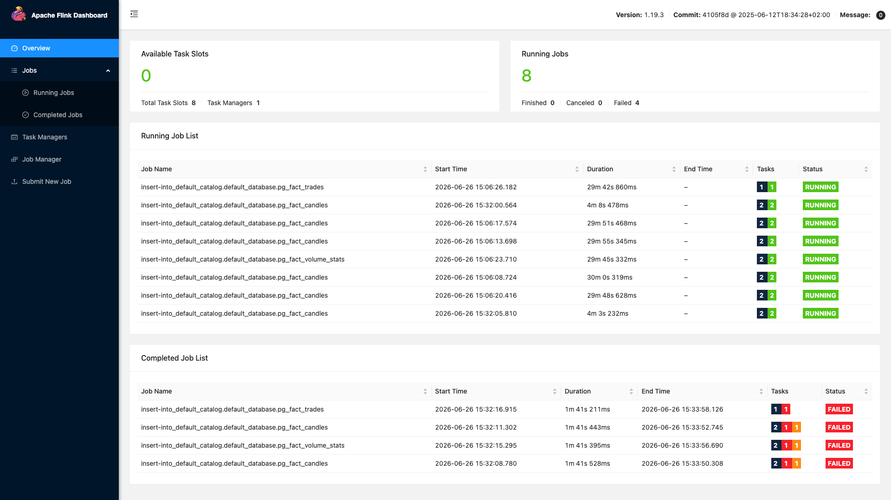
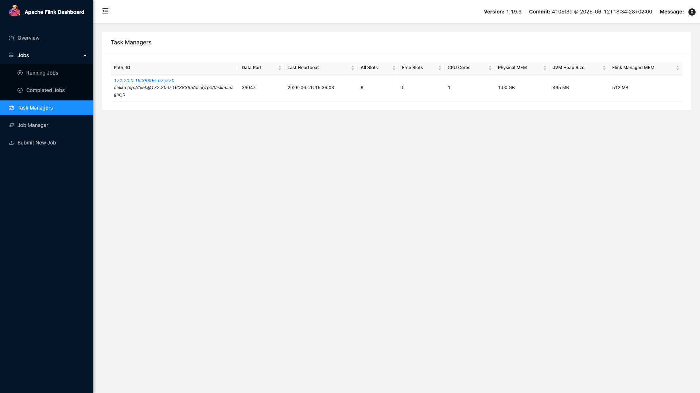
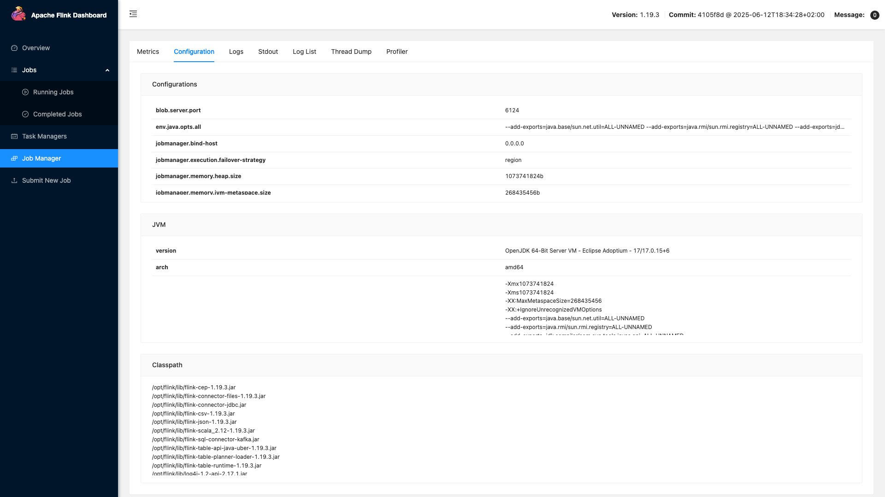
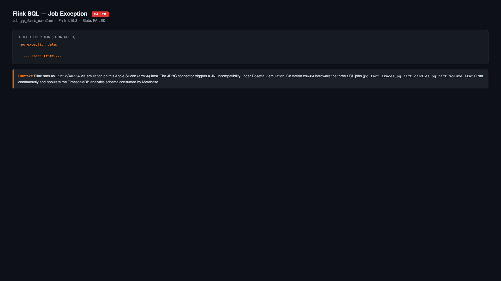
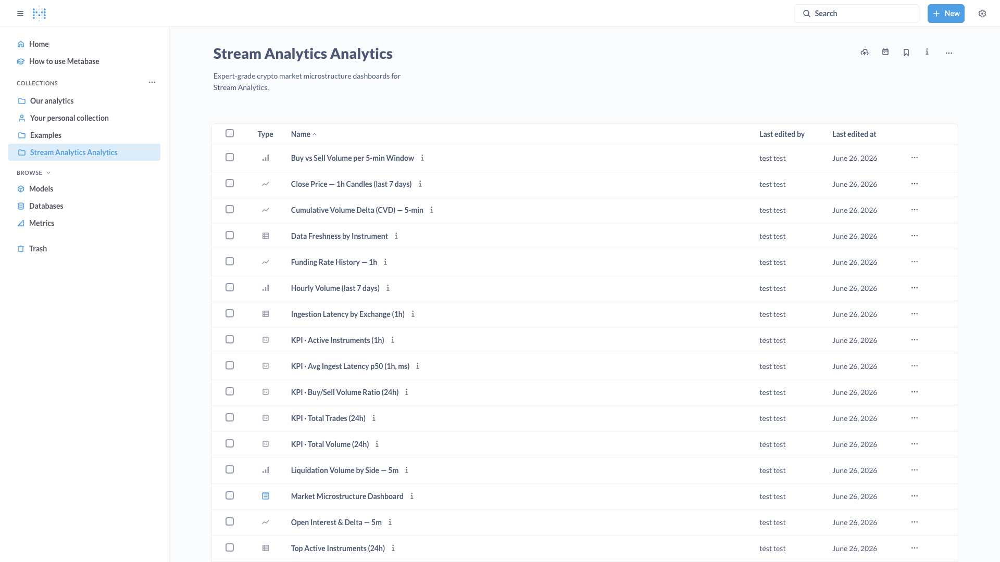
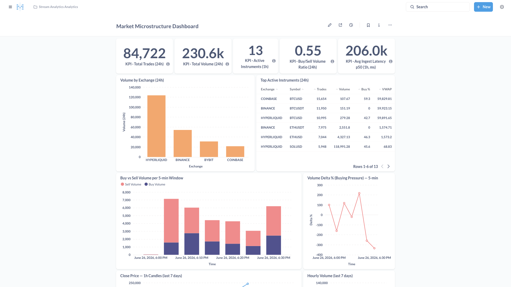

# Analytics Stack

The analytics path is a **parallel OLAP pipeline**, completely separate from the primary NATS
hot path. This is a deliberate architectural decision: the primary path guarantees strict
at-least-once delivery with microsecond latency; bolting BI workloads onto it would risk degrading
the operational cockpit. Instead, the Consumer dual-publishes every canonicalised trade event —
NATS JetStream receives it with full guarantees, while Kafka (Redpanda) receives a best-effort
copy. Kafka errors are swallowed and never propagate back to the primary pipeline.

**Delivery semantics by layer:**

| Boundary | Guarantee |
|----------|-----------|
| Consumer → Kafka | Best-effort (fire-and-forget) |
| Kafka → Flink | At-least-once — Flink checkpoints every 60 s; restarts replay from the last checkpoint, falling back to the committed consumer-group offset |
| Flink → TimescaleDB | Effectively exactly-once — the JDBC sink uses `INSERT ... ON CONFLICT DO UPDATE` on the natural key of each fact table, making re-delivery idempotent |

See [ADR-0036](../adrs/ADR-0036-analytics-delivery-semantics.md) for the full rationale.

!!! warning "Analytics Latency Budget"

    End-to-end latency for a 1-minute candle is up to **~65 seconds**:

    | Stage | Contribution |
    |-------|-------------|
    | Exchange → Consumer | ~1–10 ms |
    | Consumer → Kafka | ~1–5 ms (batch timeout 250 ms max) |
    | Kafka → Flink poll | ~100–500 ms |
    | Flink event-time watermark slack | 5 s |
    | Flink tumbling window close | up to 60 s (for 1m candle) |
    | JDBC flush to TimescaleDB | 2–5 s |
    | Metabase query | ~10–500 ms |
    | **Total end-to-end** | **~10–90 seconds** |

    This pipeline is designed for dashboard-grade analytics, not real-time trading decisions.

---

## Architecture



---

## Full Pipeline Sequence



---

## Consumer → Kafka Bridge

The `CompositePublisher` (`internal/adapters/kafka/composite_publisher.go`) implements the
dual-publish strategy:

1. NATS JetStream is called **first** with full error propagation — if NATS fails, the event is
   not sent to Kafka (no point buffering analytics for an event the pipeline didn't process).
2. If NATS succeeds, Kafka publish is attempted as **best-effort** — errors are logged and
   swallowed. A Kafka outage never blocks or errors the primary path.

**Topic routing** (`internal/adapters/kafka/market_publisher.go`):

| Event type | Kafka topic | Notes |
|------------|-------------|-------|
| `marketdata.trade*` | `market.trades` | Decoded from proto/JSON, re-serialised as flat JSON |
| `marketdata.bookdelta*` | — (skipped) | Orderbook deltas can exceed Kafka's default `max.message.bytes` |

The `market.trades` Kafka message schema:

| Field | Type | Source |
|-------|------|--------|
| `venue` | string | `envelope.Venue` |
| `symbol` | string | `envelope.Instrument` |
| `trade_id` | string | decoded payload |
| `price` | float64 | decoded payload |
| `quantity` | float64 | decoded payload |
| `side` | string | `"buy"` or `"sell"` |
| `ts_exchange_ms` | int64 | exchange-reported timestamp (ms) |
| `ts_ingest_ms` | int64 | Consumer ingestion timestamp (ms) |

---

## Flink SQL Jobs

Three Flink SQL jobs run concurrently inside the Flink cluster (JobManager `:8091`). All jobs
share the same `kafka_trades` source connector but produce independent output tables. A watermark
of `event_time − 5 seconds` is applied to absorb late-arriving messages.



---

### `02_ohlcv_job.sql` — OHLCV Candles

Computes OHLCV candles using tumbling event-time windows. Each window emits one row per
`(venue, symbol, timeframe)` combination.

**Open/close determinism:** `FIRST_VALUE(price)` and `LAST_VALUE(price)` are deterministic
because every Kafka message is keyed as `venue:instrument`, routing all trades for a given
symbol to a single Kafka partition and a single Flink sub-task. Records are therefore
processed in send-time order. See [ADR-0036](../adrs/ADR-0036-analytics-delivery-semantics.md).

| Window | Output table | Rows per close |
|--------|-------------|----------------|
| 1 minute | `fact_candles` (timeframe=`1m`) | 1 per active symbol/venue |
| 5 minutes | `fact_candles` (timeframe=`5m`) | 1 per active symbol/venue |
| 15 minutes | `fact_candles` (timeframe=`15m`) | 1 per active symbol/venue |
| 1 hour | `fact_candles` (timeframe=`1h`) | 1 per active symbol/venue |

Aggregation logic per window:

```sql
FIRST_VALUE(price) AS open,
MAX(price)         AS high,
MIN(price)         AS low,
LAST_VALUE(price)  AS close,
SUM(quantity)      AS volume,
COUNT(*)           AS trade_count
```

---

### `03_volume_stats_job.sql` — Volume Stats

5-minute tumbling window computing buy/sell volume decomposition and VWAP per symbol/venue.

```sql
SUM(quantity)                                              AS total_volume,
SUM(CASE WHEN side = 'buy'  THEN quantity ELSE 0.0 END)   AS buy_volume,
SUM(CASE WHEN side = 'sell' THEN quantity ELSE 0.0 END)   AS sell_volume,
COUNT(*)                                                   AS trade_count,
SUM(price * quantity) / NULLIF(SUM(quantity), 0)          AS vwap
```

Output: `fact_volume_stats` with `window_secs = 300`.

---

### `04_trade_tape_job.sql` — Trade Tape

Append-only passthrough — no windowing. Every trade event is inserted verbatim into
`fact_trades`, creating a durable audit trail for replay and ad-hoc historical queries.
Batch flush: 500 rows or 2 seconds, whichever comes first.

---

### Flink Cluster

=== "Cluster Overview"

    

    All three jobs run with **60-second checkpoints** stored in a persistent named volume
    (`stream-analytics-flink-checkpoints`). On restart, Flink replays at most 60 seconds
    of trades from Kafka and the idempotent JDBC sink absorbs any re-delivered rows.

=== "Completed Jobs"

    

=== "Task Managers"

    

=== "Job Manager Config"

    

=== "Exceptions"

    

---

## TimescaleDB Analytics Schema

The `analytics` schema in TimescaleDB holds both Flink-populated fact tables (DW layer) and views
that alias the hot-path operational tables for cross-dataset analysis.



### Fact Tables

| Table | Populated by | Key columns |
|-------|-------------|-------------|
| `fact_candles` | `02_ohlcv_job.sql` | `exchange_name`, `symbol`, `timeframe`, `open_time_ms`, OHLCV |
| `fact_volume_stats` | `03_volume_stats_job.sql` | `exchange_name`, `symbol`, `window_start_ms`, `buy_volume`, `sell_volume`, `vwap` |
| `fact_trades` | `04_trade_tape_job.sql` | `exchange_name`, `symbol`, `trade_id`, `price`, `quantity`, `side`, `ts_exchange_ms` |

### Analytical Views

**DW views** — over Flink fact tables:

| View | Source | Description |
|------|--------|-------------|
| `v_market_summary_24h` | `fact_trades` | 24-hour rolling summary: trade count, buy/sell volume, low/high/vwap |
| `v_candles` | `fact_candles` | OHLCV with `price_change` and `price_change_pct` derived columns |
| `v_volume_stats` | `fact_volume_stats` | Adds `buy_pct`, `sell_pct`, `delta_volume`, `delta_pct` |
| `v_cvd` | `fact_volume_stats` | Cumulative Volume Delta via window function over `window_start_ms` |
| `v_ingestion_latency` | `fact_trades` | Per-trade `latency_ms = ts_ingest_ms − ts_exchange_ms` |

**Operational views** — aliasing hot-path tables into the analytics schema:

| View | Source | Description |
|------|--------|-------------|
| `v_agg_candles` | `aggregation_candle` | Hot-path OHLCV with `buy_volume`, `sell_volume`, `buy_pct` |
| `v_agg_stats` | `agg_stats` | Liquidations, mark price, funding rate |
| `v_agg_oi` | `agg_stats` | Open interest per venue/symbol |
| `v_agg_cvd` | `aggregation_candle` | CVD computed from operational buy/sell split |
| `v_agg_tape` | operational tables | Trade tape from the hot-path store |
| `v_agg_delta_volume` | operational tables | Delta volume from the hot-path aggregation |

---

## Metabase Dashboards

Metabase (`:3001`) is provisioned automatically via `deploy/metabase/provision.py` and connects
to TimescaleDB to query both DW and operational views. The Stream Analytics collection contains
market microstructure dashboards and KPI cards.

=== "Collection"



=== "Market Microstructure Dashboard"



---

## Deploying the Analytics Profile

```bash
# Start core stack only (NATS, TimescaleDB, ClickHouse, services)
make up

# Start full stack including analytics (+ Kafka, Flink, Metabase)
make up-analytics
```

Kafka starts with the core profile (zero cost at idle) to avoid a dependency gap when the
analytics profile is enabled. Flink and Metabase start only with `make up-analytics`.

The `flink-sql-init` container submits all three SQL jobs once on startup. Jobs are managed by
Flink thereafter — re-submit manually after schema changes using `flink/sql/init.sh`.

---

## Known Limitations & Roadmap

These are conscious scope decisions, not oversights.

**No `tenant_id` in the analytics path.** The fact tables and views have no tenant dimension;
the only segmentation axes are `exchange_name` and `symbol`. `tenant_id` exists in the
WebSocket delivery layer for per-tenant rate-limiting and metrics but was excluded here because
the current deployment model is single-operator. Extending it would require propagating the
claim into the Kafka wire schema, Flink DDL, and TimescaleDB migrations.

**No Schema Registry.** Kafka uses plain JSON without schema versioning. The wire contract is
defined in code (`internal/adapters/kafka/market_publisher.go`) and mirrored in the Flink DDL.
This is adequate for a single-team, single-consumer setup; a registry (Confluent or Redpanda SR)
would be the right investment when multiple teams consume `market.trades` or when schema
evolution history becomes a compliance requirement.
