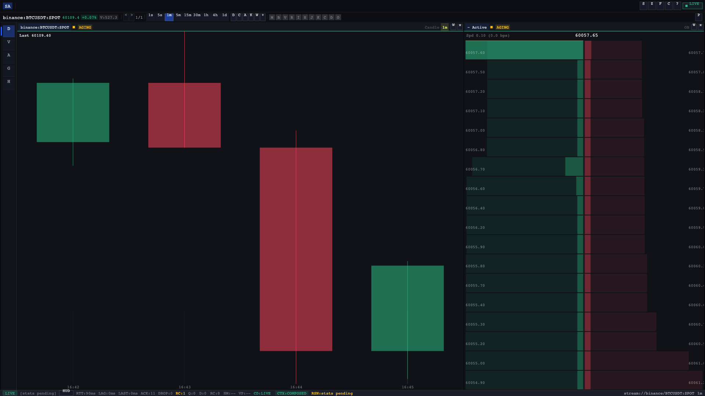

# Stream Analytics — Platform Tour

Stream Analytics is a real-time, multi-exchange cryptocurrency market data platform built for
operational decision-making. It ingests live market data from 7 exchanges simultaneously, processes
it through an actor-supervised pipeline, and delivers sub-millisecond updates to a cross-platform
cockpit UI. This is **decision infrastructure, not a trading platform** — the execution pipeline
was retired in S9.

---

!!! success "Performance Baseline (C4 Soak)"

    Validated across 10M events, 4 simultaneous exchanges, ~85 seconds of sustained load.

    | Metric | Value |
    |--------|-------|
    | Throughput | **117,697 evt/sec** |
    | Latency p50 | 7 µs |
    | Latency p95 | 13 µs |
    | Latency p99 | 56 µs |
    | Events processed | 10,000,000 |
    | Duration | ~85 seconds |

---

## Tech Stack

| Layer | Technology |
|-------|-----------|
| Language (backend) | Go 1.25, multi-module workspace (26 modules) |
| Language (client) | Odin (WASM + native via GLFW/SDL2) |
| Actor framework | Hollywood v1.0.5 |
| Message bus | NATS JetStream 2.10.18 |
| Analytics bus | Kafka — Redpanda v24.2.13 |
| Analytics engine | Apache Flink SQL 1.19 |
| BI dashboards | Metabase v0.52.2 |
| Hot storage | TimescaleDB 2.25.1 (PostgreSQL 16) |
| Cold storage | ClickHouse 24.8.8 |
| Observability | Prometheus + Grafana (5 dashboards, 100+ metrics) |
| Serialization | Protocol Buffers (proto3) + JSON |
| Test tooling | testcontainers, soak harnesses, deterministic replay |
| CI | GitHub Actions: ci-fast / ci-full / ci-nightly |

---

## System Context



---

## Service Map



---

## Explore the Platform

-   :material-chart-bar: **[Analytics Stack](analytics.md)**

    ---

    The best-effort OLAP path: Kafka → Flink SQL (3 windowed jobs) → TimescaleDB analytics schema
    (3 fact tables, 11 views) → Metabase (market microstructure dashboards).

-   :material-pipe: **[End-to-End Pipeline](pipeline.md)**

    ---

    Trace a market event from exchange WebSocket through NATS, processor, storage federation, and
    into the Odin cockpit in real time.

-   :material-server: **[Service Binaries](services.md)**

    ---

    Deep-dive into all 7 service binaries — their roles, actor trees, ports, and health endpoints
    under the Hollywood Guardian runtime.

-   :material-monitor-dashboard: **[Cockpit (Odin)](client.md)**

    ---

    The cross-platform market data cockpit: 13 widget types, 8 technical indicators, workspace
    split-tree, and a 5-layer stream health pipeline.

-   :material-chart-line: **[Observability](observability.md)**

    ---

    Prometheus metrics catalogue, 5 Grafana dashboards (100+ metrics), and 7 operational runbooks.

-   :material-speedometer: **[Performance](performance.md)**

    ---

    C4 soak results, latency percentiles, resource bounds, and the merge regression gate.

