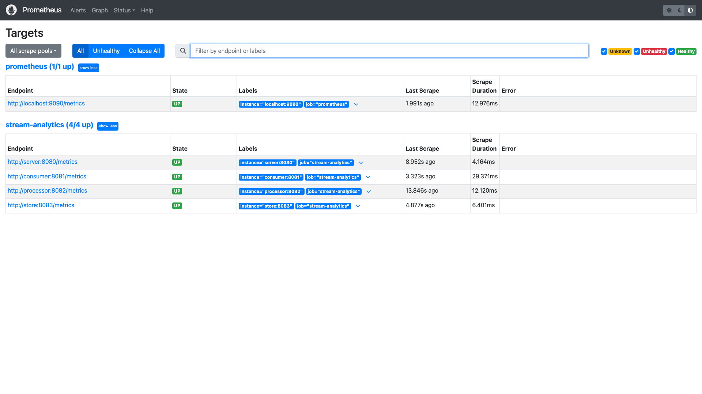
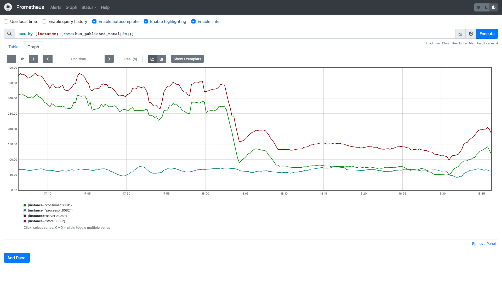
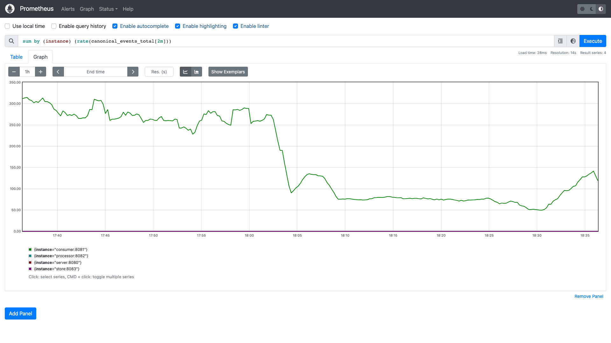
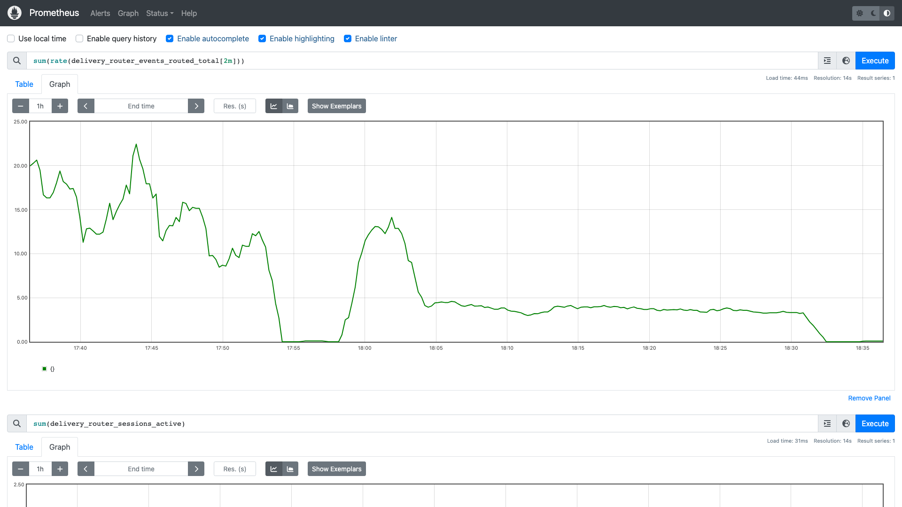
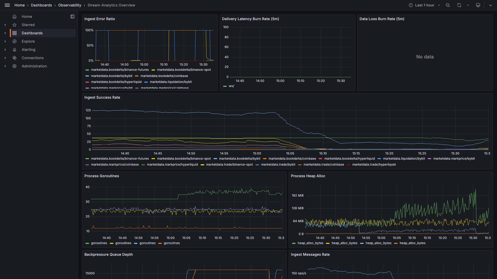
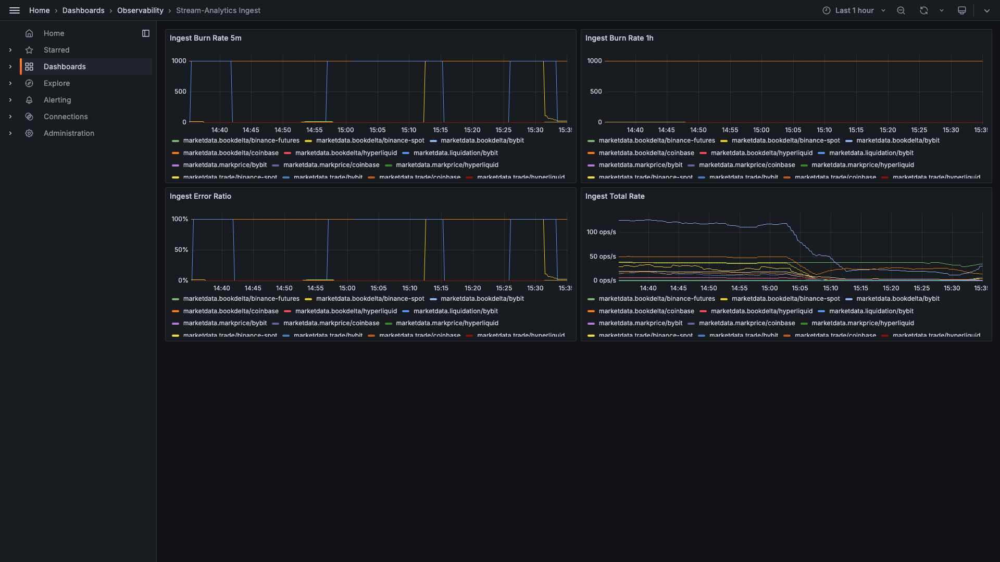
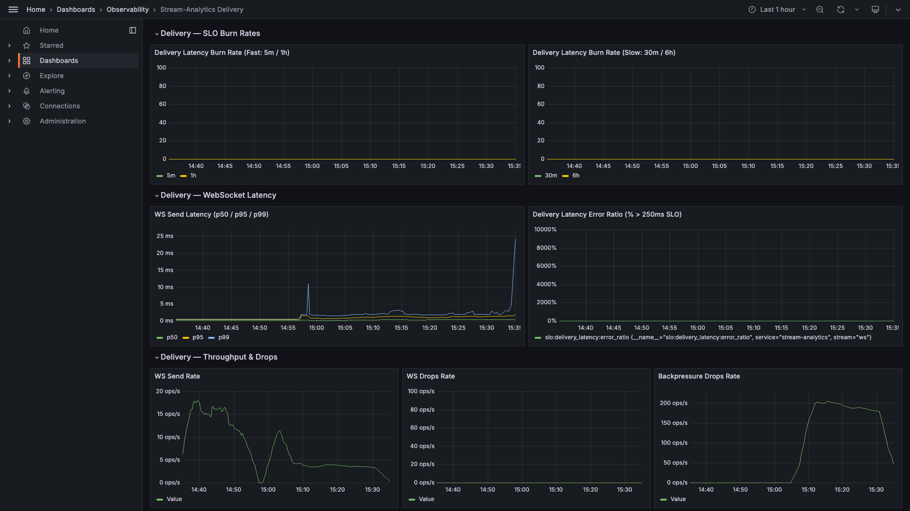
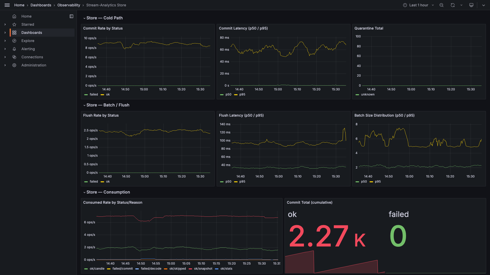
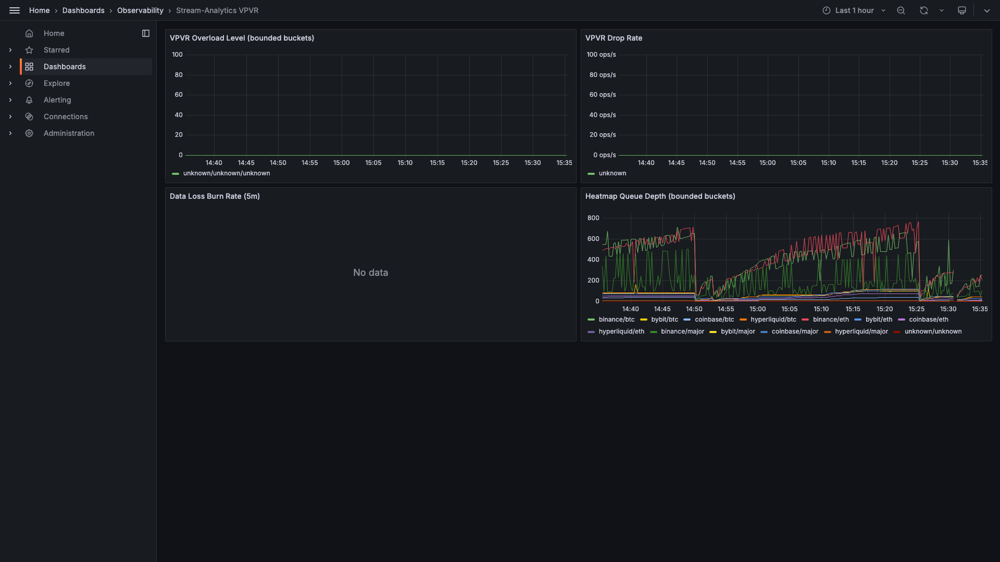

# Observability

Stream Analytics ships a full observability stack: Prometheus scrapes 100+ metrics exported by all
7 service binaries, and Grafana provides 5 purpose-built dashboards covering every layer of the
system. Seven runbooks document the response procedure for each class of operational incident.

---

## Prometheus Metrics

All binaries expose a `/metrics` endpoint scraped by Prometheus (`:9090`). The full catalogue is
documented in [Metrics Catalogue](../architecture/metrics-catalogue.md).

Key metric categories:

| Category | Coverage |
|----------|----------|
| Ingestion throughput | Events ingested per exchange per market type (`consumer_ingest_events_total`) |
| Latency histograms | Parse, apply, and render latency at p50/p95/p99 |
| Actor health | Guardian mailbox depths, supervision restart counts per actor |
| Gap detection | `prev_seq` mismatch events per NATS stream |
| Storage federation | L0/L1/L2 write rates, TimescaleDB insert latency, ClickHouse batch sizes, federation error counts |
| WebSocket delivery | Active sessions, backpressure events, subscription ACK latency, resync counts |
| VPVR / Insights | Heatmap snapshot rates, evidence detection counts, LEL rule hit rates |

---

## Grafana Dashboards

Five dashboards are provisioned automatically from `deploy/observability/grafana/dashboards/`.
Access Grafana at `http://localhost:3000` (credentials: `admin / admin` in local dev).

### Overview (`stream-analytics-overview`)

Golden signals dashboard: request rate, error rate, latency, and saturation across all services.
The starting point for any on-call investigation.

---

### Ingest (`stream-analytics-ingest`)

Consumer-focused view: throughput per exchange, CMM canonicalisation rate, deduplication drop
rate, NATS publish latency histogram (p50/p95/p99), and parse time distribution.

---

### Delivery (`stream-analytics-delivery`)

Server-focused view: active WebSocket sessions, subscription ACK latency, backpressure event
rate, resync request counts, and per-stream coherence violation alerts.

---

### Store (`stream-analytics-store`)

Storage-focused view: L0/L1/L2 write fan-out rates, TimescaleDB insert latency, ClickHouse batch
size distribution, federation error rates per tier, and hypertable compression ratios.

---

### VPVR (`stream-analytics-vpvr`)

Insights and evidence pipeline view: heatmap snapshot generation rate, VPVR level computation
throughput, LEL rule evaluation counts (wall detection, sweep, stack, etc.), and evidence
shard ownership distribution.

---

## Operational Runbooks

Seven runbooks in `docs/observability/runbooks/` cover the most common incident scenarios:

| Runbook | Incident Scenario |
|---------|------------------|
| [Bus](../observability/runbooks/bus.md) | NATS JetStream bus degradation — message lag, consumer group stall |
| [Ingest](../observability/runbooks/ingest.md) | Exchange adapter disconnect or sustained data gap |
| [WebSocket](../observability/runbooks/websocket.md) | WebSocket delivery backpressure — client session drops |
| [Guardian](../observability/runbooks/guardian.md) | Actor supervisor restart storm — cascading actor failures |
| [Consumer Stall](../observability/runbooks/consumer-stall.md) | Consumer throughput drops to zero |
| [VPVR Overload](../observability/runbooks/vpvr-overload.md) | VPVR computation overload — insights pipeline falls behind |
| [Index](../observability/runbooks/index.md) | Runbook index and escalation guide |
