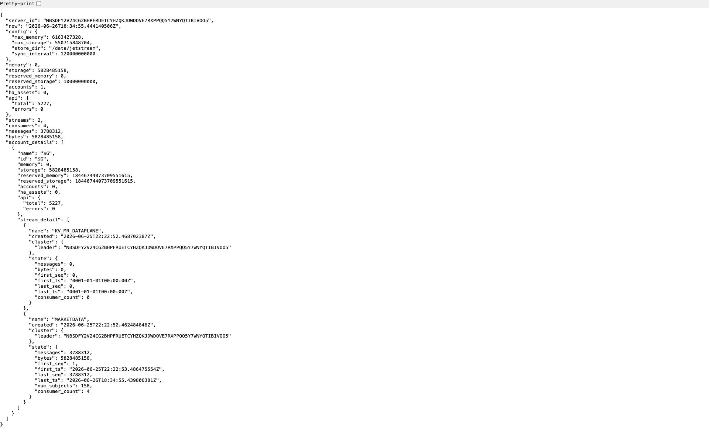
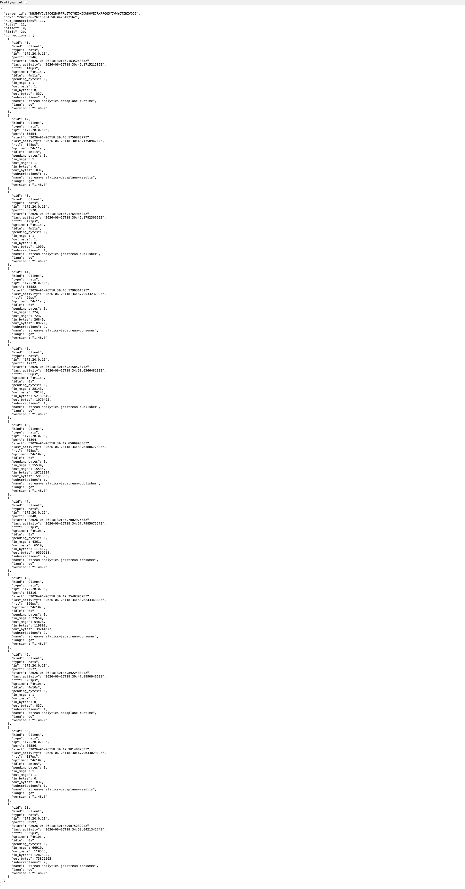
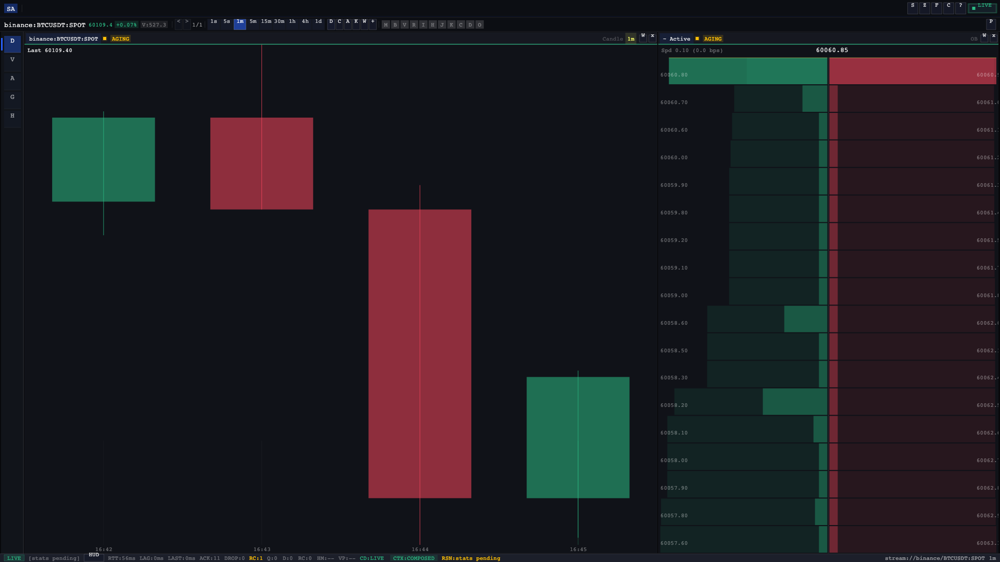

# End-to-End Pipeline

The hot path is the primary real-time data flow. A raw market event emitted by an exchange
WebSocket reaches the Odin cockpit in single-digit microseconds of processing latency, passing
through five stages of transformation and delivery.

---

## Full Sequence



---

## Pipeline Stages

### Exchange Adapters

Seven exchange adapters maintain persistent WebSocket connections, each implementing the
`exchange.Adapter` port:

| Exchange | Market Type | Adapter |
|----------|------------|---------|
| Binance Spot | SPOT | `adapters/exchange/binance/` |
| Binance Futures | USD_M_FUTURES | `adapters/exchange/binancef/` |
| Bybit | USD_M_FUTURES | `adapters/exchange/bybit/` |
| Coinbase | SPOT | `adapters/exchange/coinbase/` |
| HyperLiquid | USD_M_FUTURES | `adapters/exchange/hyperliquid/` |
| Kraken Spot | SPOT | `adapters/exchange/kraken/` |
| Kraken Futures | USD_M_FUTURES | `adapters/exchange/krakenf/` |

Each adapter normalises raw exchange messages into the **Canonical Market Model (CMM)** — a
uniform venue/symbol representation — before passing events downstream. Deduplication runs at
ingestion time using an `idempotency_key` derived from venue, symbol, and timestamp.

---

### Consumer (`cmd/consumer` — `:8081`)

The consumer binary hosts the exchange actor fleet under the Hollywood Guardian runtime.
`ExchangeActor` instances manage connection lifecycle (exponential backoff on disconnect,
gap-fill on reconnect). `DeduplicationActor` filters repeated events before publish.

Canonicalised events are published to NATS JetStream under the `marketdata.>` subject hierarchy.

---

### NATS JetStream (`:4222` / `:8222`)

NATS JetStream is the durable message bus between Consumer and Processor. Every envelope carries
two sequencing fields:

!!! info "Envelope Sequencing"

    Each NATS envelope includes `seq` (monotonically increasing per stream) and `prev_seq`
    (the sequence of the immediately preceding message). Receivers detect gaps by checking
    `prev_seq != last_seq + 1`. A mismatch triggers a resync request to the server.

    This invariant is never bypassed — publishing an envelope without correct `prev_seq`
    threading breaks client gap detection.

---

### Processor (`cmd/processor` — `:8082`)

The processor consumes `marketdata.>` from NATS and runs the aggregation engine:

- **9 OHLCV timeframes**: 1s, 5s, 15s, 30s, 1m, 5m, 15m, 1h, 4h
- **Stats aggregation**: funding rate, liquidations, mark price, open interest
- **Heatmap snapshots**: price-level volume distributions
- **VPVR**: Volume Profile Volume Rate — per-level buy/sell volume
- **LEL evidence detection**: 5 stateful Liquidity Evidence Layer rules

Key actors: `AggregationActor`, `InsightsActor`, `EvidenceActor`.

---

### Server (`cmd/server` — `:8080`)

The server binary provides the WebSocket delivery gateway and HTTP API. Clients connect via the
Terminal_V1 protocol, which supports:

- **Hello** handshake — server announces available streams
- **Subscribe** — client selects streams; server ACKs
- **Snapshot** — initial state delivery
- **Backfill** — `getrange` / `getlast` / `resync` for historical data
- **Live events** — continuous envelope delivery with backpressure management

Rate limiting and per-stream coherence checking run at the delivery layer.

---

### Store (`cmd/store` — `:8083`) + Storage Federation

The store binary persists aggregated events through a 3-tier storage federation:



| Tier | Backend | Role |
|------|---------|------|
| L0 | In-memory ring buffer | Hot write buffer, sub-µs access |
| L1 | TimescaleDB 2.25.1 (PG16) | Hot storage, range queries |
| L2 | ClickHouse 24.8.8 | Cold storage, analytical scans |

Key actors: `StoreActor`, `FederationActor`. Writes fan out to L1 and L2 in parallel; L0 absorbs
burst traffic above L1 insertion throughput.

---

### Odin Client (`:8090`)

The Odin cockpit receives live event envelopes over the Terminal_V1 WebSocket and renders them to
a `<canvas>` element using Canvas2D. The 5-layer stream health pipeline
(transport → parse → apply → render → display) tracks latency at each stage via WASM probe exports.

